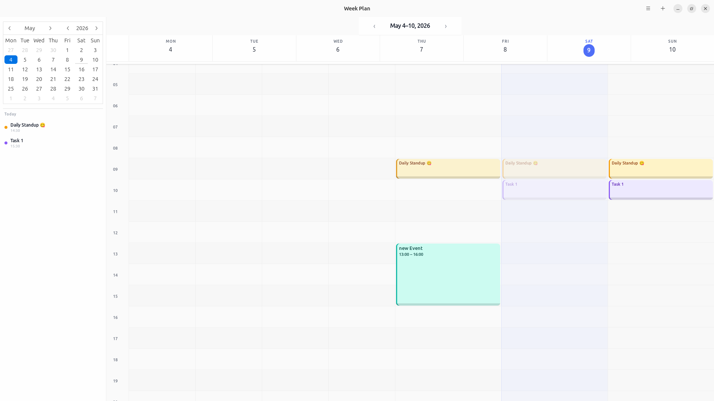
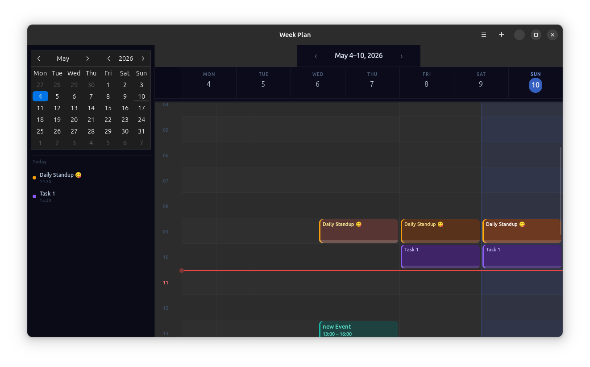

<div align="center">

# WeekPlan

A beautiful, fast, week-at-a-glance calendar for GNOME Linux.

[](LICENSE)
[](https://www.python.org/)
[](https://gtk.org/)
[](https://github.com/sssurendra99/weekplan/commits/main)
[](https://github.com/sssurendra99/weekplan/issues)
[](CONTRIBUTING.md)
[](CODE_OF_CONDUCT.md)



<!-- TODO: capture and commit docs/images/screenshot.png before pushing -->

</div>

---

## Features

- ✨ **Live now-line and progress bars** — see what's happening at a glance
- 📅 **Weekly view with all 7 days and 24 hours**, smooth scrolling
- 🔁 **Recurring events** — daily, weekly, weekdays, custom RRULE
- 🔔 **Native GNOME notifications** with configurable lead time
- ☁️ **Two-way Google Calendar sync**
- 🎨 **Native libadwaita design** — looks at home on GNOME
- ⚡ **Lightweight** — ~60 MB RAM idle (vs. 300+ MB for Electron alternatives)
- ⌨️ **Full keyboard shortcuts**
- 🌗 **Light and dark mode** support

---

## Install

### From Flathub

Coming soon. Track progress in [issue #1](https://github.com/sssurendra99/weekplan/issues/1).

### From source (Flatpak)

```bash
git clone https://github.com/sssurendra99/weekplan.git
cd weekplan
make flatpak-build
flatpak run com.weekplan.app
```

### From source (development)

Install system dependencies for your distro, then follow the common steps below.

<details>
<summary>Fedora</summary>

```bash
sudo dnf install python3-gobject-devel gtk4-devel libadwaita-devel \
  cairo-gobject-devel pkg-config
```

</details>

<details>
<summary>Ubuntu / Debian</summary>

```bash
sudo apt install python3-gi python3-gi-cairo gir1.2-gtk-4.0 gir1.2-adw-1 \
  libcairo2-dev pkg-config python3-dev libgirepository1.0-dev
```

</details>

<details>
<summary>Arch</summary>

```bash
sudo pacman -S python-gobject gtk4 libadwaita
```

</details>

```bash
git clone https://github.com/sssurendra99/weekplan.git
cd weekplan
python -m venv .venv
source .venv/bin/activate
pip install -e .
python -m weekplan
```

---

## Quick start

- Press **Ctrl+N** to add an event.
- Use **← →** to navigate weeks, **Ctrl+T** to jump to today.
- Press **F5** to sync with Google Calendar.
- Connect your Google account in Settings to enable sync (see [docs/GOOGLE_SETUP.md](docs/GOOGLE_SETUP.md)).

---

## Keyboard shortcuts

| Action | Shortcut |
|---|---|
| New event | `Ctrl+N` |
| Today | `Ctrl+T` |
| Previous week | `←` |
| Next week | `→` |
| Sync | `F5` |
| Quit | `Ctrl+Q` |
| Open shortcuts dialog | `Ctrl+?` |

---

## Screenshots


<!-- TODO: capture and commit docs/images/screenshot.png before pushing -->

<details>
<summary>Week view — dark mode</summary>



<!-- TODO: capture and commit docs/images/screenshot-dark.png before pushing -->

</details>

<details>
<summary>Event dialog</summary>


<!-- TODO: capture and commit docs/images/screenshot-dialog.png before pushing -->

</details>

<details>
<summary>Live banner close-up</summary>


<!-- TODO: capture and commit docs/images/screenshot-banner.png before pushing -->

</details>

---

## Contributing

Contributions of all sizes are welcome — bug reports, feature suggestions, documentation, translations, and code. Start with [CONTRIBUTING.md](CONTRIBUTING.md), or browse [good first issues](https://github.com/sssurendra99/weekplan/issues?q=is%3Aissue+is%3Aopen+label%3A%22good+first+issue%22) if you're looking for a place to start. Have a question or idea? Open a [Discussion](https://github.com/sssurendra99/weekplan/discussions).

---

## Roadmap

- [x] Week view
- [x] Recurring events
- [x] Notifications
- [x] Google Calendar sync
- [ ] Month view
- [ ] Multiple calendars with toggleable visibility
- [ ] iCal import/export
- [ ] CalDAV support (Nextcloud, Fastmail)
- [ ] Natural language quick-add ("lunch with Sara tomorrow 1pm")
- [ ] Translations (i18n)

---

## Built with

Python · GTK4 · libadwaita · SQLite · python-dateutil · Google Calendar API · ❤️ for the GNOME desktop

---

## License

MIT © 2026 Sumal Surendra. See [LICENSE](LICENSE) for details.

---

## Acknowledgments

Inspired by GNOME Calendar. Built on the shoulders of the libadwaita and PyGObject teams. Thanks to every contributor who files an issue or sends a PR.

---


