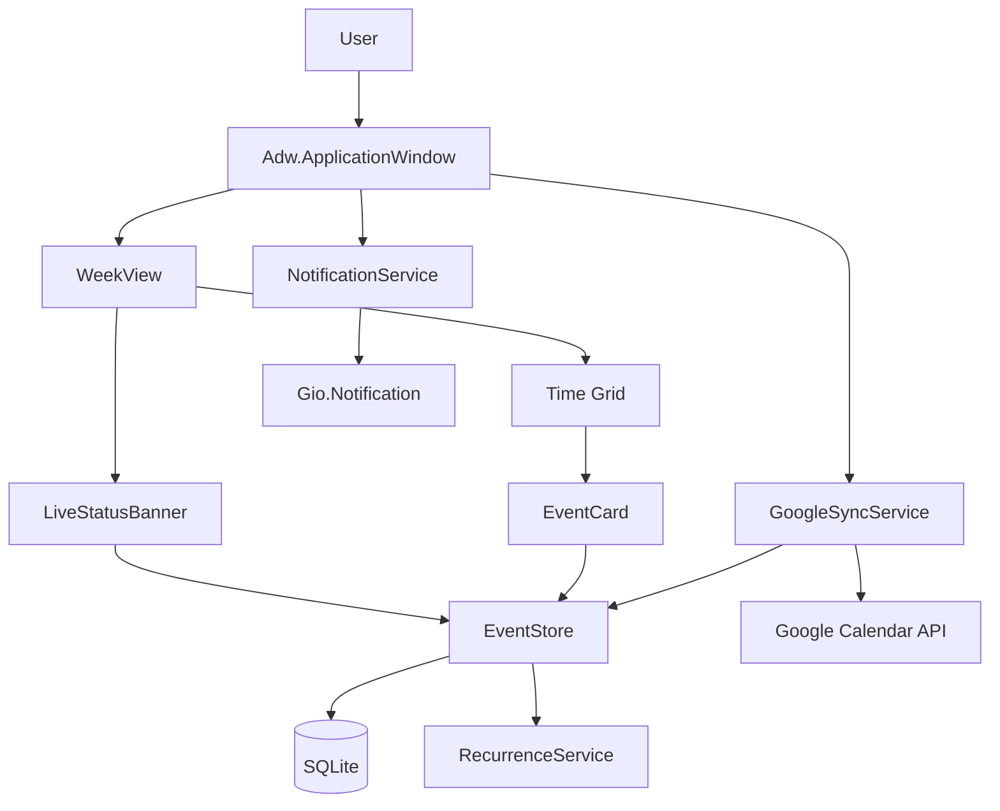

# Architecture

WeekPlan is a single-process GTK4 desktop application. The UI layer (widgets) talks to a SQLite-backed event store through a thin model layer; two optional services (notifications, Google Calendar sync) run alongside it. There is no network daemon, no background process, and no IPC — the app is self-contained within a single Flatpak sandbox.

## Data flow



## Module responsibilities

| File | Responsibility |
|------|----------------|
| `__main__.py` | Entry point — calls `application.main()` |
| `application.py` | `Adw.Application` subclass; CSS loading, service wiring |
| `window.py` | Main `Adw.ApplicationWindow`; header bar, sidebar, keyboard shortcuts |
| `config.py` | XDG paths, app ID, `_()` gettext stub, env-var helpers |
| `models/event.py` | `Event` dataclass with validation in `__post_init__` |
| `models/store.py` | SQLite wrapper; schema migrations; all DB access |
| `widgets/week_view.py` | 7-day grid container; now-line; live status banner |
| `widgets/event_card.py` | Single event tile; color, time label, click handler |
| `widgets/event_dialog.py` | Create/edit `Adw.Dialog`; field population and saving |
| `widgets/live_status.py` | Live "now" + "up next" banner with progress bar |
| `services/recurrence.py` | RRULE string → list of `(start, end)` occurrences |
| `services/notifications.py` | Schedule and fire `Gio.Notification` per occurrence |
| `services/google_sync.py` | OAuth 2.0 flow + two-way Google Calendar sync |
| `services/timefmt.py` | Time formatting helpers; `WEEKPLAN_FAKE_NOW` override |

## Data model

### Event dataclass

```python
@dataclass
class Event:
    title: str
    start: datetime          # always UTC-aware
    end: datetime            # always UTC-aware, must be > start
    id: int | None = None    # None until persisted
    description: str = ""
    color: str = "#3584e4"   # GNOME blue default
    all_day: bool = False
    rrule: str | None = None  # RFC 5545 RRULE string, e.g. "FREQ=WEEKLY;BYDAY=MO"
    google_id: str | None = None
    updated_at: datetime = field(default_factory=lambda: datetime.now(UTC))
```

`__post_init__` raises `ValueError` if `end <= start`.

### SQLite schema

```sql
CREATE TABLE schema_version (version INTEGER PRIMARY KEY);

CREATE TABLE events (
    id          INTEGER PRIMARY KEY AUTOINCREMENT,
    title       TEXT    NOT NULL,
    start       TEXT    NOT NULL,  -- ISO 8601 UTC
    end         TEXT    NOT NULL,
    description TEXT    NOT NULL DEFAULT '',
    color       TEXT    NOT NULL DEFAULT '#3584e4',
    all_day     INTEGER NOT NULL DEFAULT 0,
    rrule       TEXT,              -- NULL = one-off event
    google_id   TEXT,
    updated_at  TEXT    NOT NULL
);

CREATE TABLE tombstones (
    event_id  INTEGER NOT NULL,
    google_id TEXT    NOT NULL,
    deleted_at TEXT   NOT NULL
);
```

Datetimes are stored as ISO 8601 strings (UTC). The store converts to `datetime` objects with `tzinfo=UTC` on read.

### Recurring events

Recurring events are stored as a **single master row** with an `rrule` column. They are never "exploded" into the database. Instead, `RecurrenceService.expand(event, range_start, range_end)` uses `python-dateutil`'s `rrulestr` to generate occurrences on the fly for any query window. This keeps the database small and makes editing the recurrence rule trivial (update one row).

### Tombstones

When a local event with a `google_id` is deleted, its IDs are written to the `tombstones` table instead of being immediately erased. The next sync pass reads tombstones, deletes the corresponding Google Calendar events, then clears the tombstone rows. This ensures deletions propagate even if the app is offline at delete time.

## Threading model

GTK is single-threaded. All UI mutations must happen on the **GTK main thread**.

| Operation | Mechanism |
|-----------|-----------|
| Per-minute now-line/banner refresh | `GLib.timeout_add(60_000, callback)` — fires on main thread |
| Google Calendar sync | `threading.Thread` for network I/O; results posted back via `GLib.idle_add` |
| Notification scheduling | Pure main-thread `GLib.timeout_add` per upcoming event |

Never call `Gtk.*` or `Adw.*` methods from a background thread. Pass data back through `GLib.idle_add(fn, *args)`.

## Lifecycle

### Startup

```
Adw.Application.run()
  └─ activate signal
       ├─ load CSS (Adw.StyleManager + Gtk.CssProvider)
       ├─ open EventStore (SQLite connect + migrate)
       ├─ start NotificationService (schedules first pass)
       ├─ create WeekPlanWindow and present()
       └─ trigger initial Google sync (if credentials exist)
```

### Shutdown

The `application.quit()` path (Ctrl+Q or window close):

1. `NotificationService` cancels pending `GLib.timeout_add` handles.
2. `EventStore.close()` commits any open transaction and closes the SQLite connection.
3. `Adw.Application` releases its process hold — the GLib main loop exits.

## Key design decisions

### GTK4 + libadwaita over Qt or Electron

GNOME's HIG compliance, system color scheme integration, and portal support are built in. Memory footprint at idle is ~60 MB versus 300+ MB for an Electron alternative. Qt would also work but requires an extra toolkit dependency and produces a visually foreign app on GNOME.

### SQLite over flat JSON

Events need range queries (`SELECT … WHERE start >= ? AND start < ?`). SQLite handles this with an index; JSON would require loading and scanning all events on every navigation. Transactions also make the tombstone pattern safe.

### python-dateutil over hand-rolled recurrence

RFC 5545 recurrence rules have many edge cases (month-end, DST, count limits, until dates, EXDATE). `dateutil.rrule` is a mature, tested implementation. Rolling our own would be months of work for something that is not WeekPlan's core value.

### Flatpak over native packaging

A single Flatpak build runs on Fedora, Ubuntu, Arch, and any other systemd-based distro. Maintaining distro-specific packages (`.deb`, `.rpm`, AUR) in parallel is impractical for a small project.

### No tray icon

GNOME deprecated the system tray in GNOME 3.26. Apps that need background presence should use the XDG background portal. WeekPlan uses desktop notifications instead, which is the GNOME-approved pattern.

### Live status banner

The app's core value proposition is live awareness of your day, not just event storage. The banner makes the current event and next-up visible at a glance without opening a dialog, which differentiates WeekPlan from a generic calendar.

## Extension points

### New event color

1. Add a CSS class `.color-my-color { background-color: …; }` to `src/weekplan/style.css`.
2. Add the color name to the `Adw.ComboRow` options in `widgets/event_dialog.py`.
3. Handle it in `EventCard._apply_color()`.

### New keyboard shortcut

```python
action = Gio.SimpleAction.new("my-action", None)
action.connect("activate", self._on_my_action)
self.add_action(action)
app.set_accels_for_action("win.my-action", ["<Primary>m"])
```

### New recurrence preset

1. Add the RRULE string to the preset list in `services/recurrence.py`.
2. Add the human-readable label to the recurrence `Adw.ComboRow` in `widgets/event_dialog.py`.

### New sync provider

Refactor planned for v0.2: extract `GoogleSyncService` behind a `SyncProvider` abstract base class with `push(events)` / `pull(since)` / `delete(google_id)` methods. New providers (CalDAV, iCal export) would implement that interface without touching the rest of the stack.
